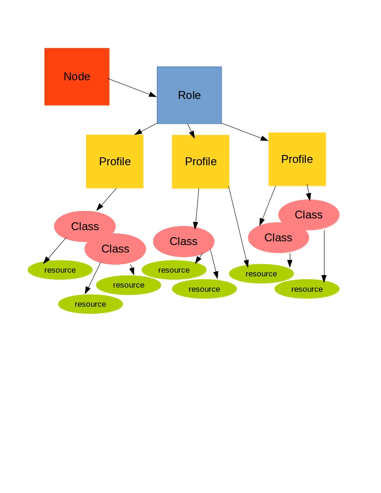
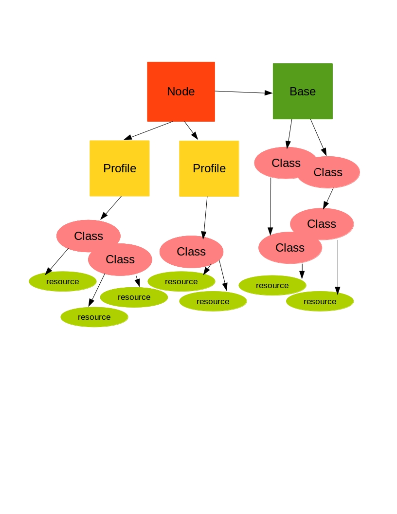

!SLIDE

# Architecting the code base #

!SLIDE

# Things to avoid #

  * node inhertiance
  * code in node definitions
  * code in site.pp
  * multiple levels of class inheritance
  * class nesting
  * repeating yourself

!SLIDE

# Node Inheritance #

    @@@puppet
    node tlab-blades
    {
      include cecs::role::linux_teuscher_sys
      include cecs::role::server
    }

    node 'taffey.ece.pdx.edu'
      inherits tlab-blades
    {
      include nvidia
    }

!SLIDE

# Code in node definitions

    @@@puppet
    node oscon {
      include web
      include apache
      include puppet::client

      $action = '/usr/bin/oscon speak'

      cron { 'speak_on_puppet':
        command => $action,
      }

      # more code
    }

!SLIDE

# Code in site.pp

    @@@puppet
    # /etc/puppet/manifests/site.pp

    File {
      owner => '0',
      group => '0',
    }

    import 'nodes/*.pp'

    include puppet::client

!SLIDE

# Multiple levels of class inheritance ##

    @@@puppet
    class server inherits base
    class webs   inherits server
    class nginx  inherits webserver
    class myapp  inherits nginx

!SLIDE

# Class nesting #

* openstack::server ->
* openstack::template ->
* openstack::base ->
* file['puppet.conf'],

!SLIDE

# How to not repeat yourself #

* Use templates instead of multiple files
* Use parametized classes instead of duplicating classes
* Abstract business logic into process specific modules

!SLIDE bullets incremental

# Roles and Profiles #

*  Node definitions should only include roles
*  Two ways to do this
*  role per machine type
*  Base class and service-mapped roles

!SLIDE

* nodes include roles
* roles include profiles
* profiles include resources and classes
* resources come from two places
* puppet core and modules

!SLIDE center

!SLIDE center

!SLIDE

# Roles #

    @@@puppet
    class role::dbserver {
      include profile::mysqlserver
      include profile::pgserver
    }

!SLIDE

# Profiles #

    @@@puppet
    class profile::pgserver (){
        class { 'postgresql::globals': } ->
        class { 'postgresql::server': }
        cron { 'backup_postgres.sh':
            hour => '0', }
        logrotate::rule { 'postgresql-common': }
    }

!SLIDE

# One role per node #

    @@@puppet

    node 'paste.openstack.org' {
      class { 'openstack_project::paste':
        db_host     => hiera('paste_db_host', 'localhost'),
        db_password => hiera('paste_db_password', 'XXX'),
        sysadmins   => hiera('sysadmins', []),
      }
    }

!SLIDE code

# Base class with profiles #

    @@@puppet
    node
      'rita.cat.pdx.edu'
    {
      class { 'cecs':
        notifications => 'daytime',
        login         => 'all_students',
        root_level    => 'junior_rooters',
      }

      include cecs::profile::linux_login_sys
      include cecs::profile::killvnc
      include cecs::profile::license::comsol
    }

!SLIDE 

# Questions on Architecture?
